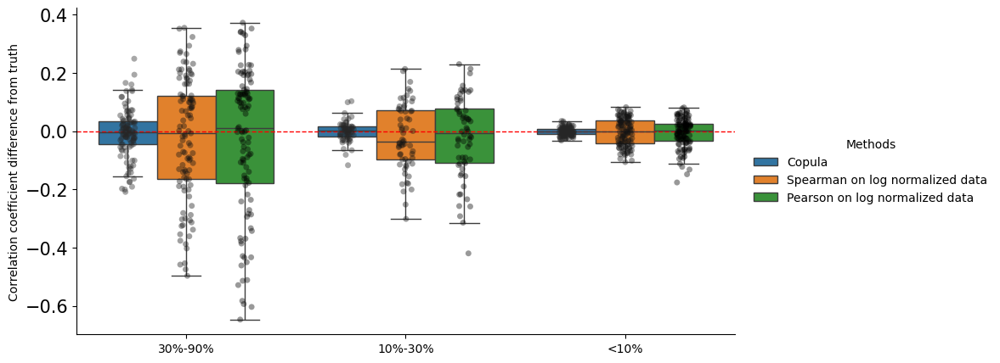

Overview
----------
Copulacci is a tool for learning cell-cell interactions (CCIs) from sparse spatial transcriptomics data. Given input spatial transcriptomics data, i.e. a UMI count matrix and spatial locationsm Copulacci fits a copula distribution to the data; specifically, for each ligand-receptor pair, Copulacci fits a Gaussian copula with Poisson marginals to ligand-receptor measurements across every pair of adjacent spots. The Poisson marginals account for the integer UMI counts (no log-normalization necessary) and sparsity of the data, while the Gaussian copula allows us to compute a _correlation coefficient_ which quantifies the interaction between the ligand and receptor. 

Input/Output/model parameters
----------
The input is an `adata` with integer UMI counts and spatial locations. The output is a list of ligand-receptor pairs with (1) an estimated copula correlation coefficient, and (2) estimated (log-normalized )mean ligand and receptor expression. For spatial data where the cells are irregularly organized, then Copulacci requires the radius of the spatial adjacency graph; otherwise, Copulacci requires no extra parameters.


Simulation
-----------
To view this in action we can demonstrate the copula in effect via simulation `notebook/tutorial/Copula_based_correlation_coefficient`

Installation
------------
```python=3.9
conda create -n copulacci python=3.9
conda activate copulacci
git clone git@github.com:raphael-group/copulacci.git
cd copulacci
pip install .
```

Quickly run for reproducing the simulated plots from paper
-----------------------------------------------------------
Download the prepared data from the [drive](https://drive.google.com/drive/folders/1Z14_vglLj_IiSS1sfE1PBSVHivX3hd8N?usp=sharing)

```python
repro_df = pd.read_csv('simulated_data_with_spearman_pearson.csv')
import pickle
with open('ismb_submission_simulated_data_24_1.pkl', 'rb') as file:
    data_list_check = pickle.load(file)


copula_params = model2.CopulaParams()
opt_params = model2.OptParams()
## For quick run one can avoid restarts
#opt_params = opt_params._replace(num_starts=1)

opt_res = Parallel(n_jobs=20, verbose=1)(
    delayed(model2.call_optimizer)(
        x,
        y,
        _n_array,
        _n_array,
        copula_params,
        opt_params,
        use_zero_cutoff = True,
        zero_cutoff = 0.8
    ) for (x,y,_,_,_n_array) in data_list_check)

# Store the results
cop_res = [opt_res[i][0] for i in range(len(opt_res))]
repro_df.loc[:, 'cop'] = cop_res
repro_df.loc[:, 'cop_method'] = [opt_res[i][3] for i in range(len(opt_res))]
# Filter out the ligand-receptors for which copula was not run
results_filt = repro_df.loc[repro_df.cop_method == 'copula'].copy()
```

We can produce the following boxplot dividing the samples in different buckets
```python
cop_res = [opt_res[i][0] for i in range(len(opt_res))]
repro_df.loc[:, 'cop'] = cop_res
repro_df.loc[:, 'cop_method'] = [opt_res[i][3] for i in range(len(opt_res))]
bins = [0,0.1,0.3,0.6,0.9]
# Only take where copula was run
results_filt.loc[:, 'rho_bucket'] = pd.cut(abs(results_filt.rho), bins=bins,
                include_lowest=True,
                labels = ['<10%','10%-30%','30%-60%','70%-90%'])
bins = [0,0.1,0.3,0.9]
labels = ['<10%','10%-30%','30%-90%']
results_filt.loc[:, 'zr_cat'] = pd.cut(results_filt.zero_ratio, bins=bins,
                include_lowest=True,
                labels = labels
                )
results_filt.loc[:, 'zz_cat'] = pd.cut(results_filt.zz_ratio, bins=bins,
                include_lowest=True,
                labels = labels)


res_filt_melt = pd.melt(
    results_filt,
    id_vars = ['rho','rho_bucket','sparse_frac','zr_cat','zz_cat'],
    value_vars = ['spearman_log', 'pearson_log' , 'cop'],
    var_name = 'method', value_name = 'value'
)

res_focus = results_filt.copy()
for col in ['spearman_log', 'pearson_log', 'cop',]:
    res_focus.loc[:, col+'_diff'] = res_focus.rho - res_focus[col]

res_focus_melt = pd.melt(
    res_focus,
    id_vars = ['rho','rho_bucket','sparse_frac','zr_cat','zz_cat'],
    value_vars = ['spearman_log_diff', 'pearson_log_diff', 'cop_diff'],
    var_name = 'method', value_name = 'difference'
)

plt.figure(figsize=(10, 5))
label_dict = { 'cop_diff' : 'Copula', 'spearman_diff': 'Spearman', 'pearson_diff' : 'Pearson',
              'spearman_log_diff': 'Spearman on log normalized data',
              'pearson_log_diff' : 'Pearson on log normalized data'}
sns.stripplot(x="zr_cat", y="difference", hue="method",
              data=res_focus_melt ,
              jitter=True,
              palette='dark:black',
              legend = None,
              hue_order=['cop_diff', 'spearman_log_diff', 'pearson_log_diff'],
              #palette="Set5",
              alpha = 0.4,
              dodge=True,
              linewidth=0,
              edgecolor='gray',
             order = labels[::-1])

sns.boxplot(x="zr_cat", y="difference", hue="method",
            data=res_focus_melt,
            #palette="Set5",
            hue_order=['cop_diff','spearman_log_diff', 'pearson_log_diff'],
            fliersize=0,
            order = labels[::-1]
           )

plt.xlabel('', fontsize = 10)
plt.ylabel('Correlation coefficient difference from truth', fontsize = 10)
plt.xticks(fontsize=10)
plt.yticks(fontsize=15)
plt.axhline(y=0, c = 'r', linewidth = 1, linestyle='--')


#leg = plt.gca().get_legend()
leg = plt.legend(
    title="Methods",
                 loc='right', bbox_to_anchor=(1.4,0.5),
          frameon=False);

# Replace the legend labels using the custom handler
for text, handle in zip(leg.texts, leg.legend_handles):
    text.set_text(label_dict.get(text.get_text(), text.get_text()))

plt.setp(leg.texts, fontsize='10')
sns.despine()
plt.show()
```


